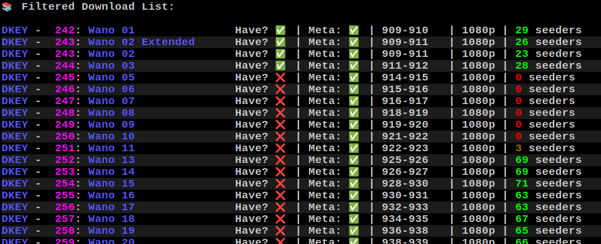
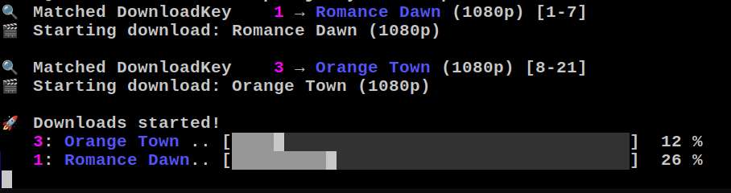
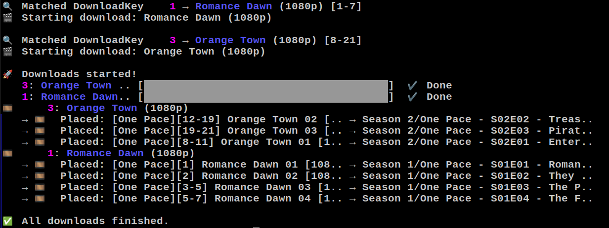

# 🏴‍☠️ OpforJellyfin


CLI-tool to automate download and organisation of [One Pace](https://onepace.net) episodes for **Jellyfin**!

> ✨ Torrent downloads  
> ✨ Placement after Jellyfin standards  
> ✨ Matched to metadata shamelessly stolen from [SpykerNZ/one-pace-for-plex](https://github.com/SpykerNZ/one-pace-for-plex)  

---

## 📸 Examples

1. Example command:

   ```bash
   ./opfor list -t wano
   ```

   

2. Downloading episodes:

   ```bash
   ./opfor download 1 3
   ```

   

3. Finished download shows file placement:

   

## 🚀 Installation

1. **Install Go** (version ≥ 1.23)

1. Clone repo:

    ```bash
    git clone https://github.com/tissla/opforjellyfin.git
    cd opforjellyfin
    ```

1. Build binary:

    ```bash
    go build -o opfor
    ```

## 🔧 Usage (Start Here!)

1. Set your download directory before doing anything else. All your metadata will be stored here, and downloads will be matched to their proper folders.

    ```bash
    ./opfor setDir "/media/One Piece/One Pace"
    ```

1. Find all available episodes with 'list', or use the -t flag to specify a title, or -r flag to specify a key-range.

    ```bash
    ./opfor list
    ./opfor list -t Wano
    ./opfor list -r 15-20
    ```

1. Download a torrent by using the downloadkey, displayed in front of the title. You can download one or multiple at the same time.

    ```bash
    ./opfor download 15 16 17
    ```

## 📦 Metadata

I hope to continually update [metadata here!](https://github.com/tissla/one-pace-jellyfin)

The 'sync' command allows the user to stay up to date with new additions to the metadata-repo.

### Steps to make sure Jellyfin doesn't mess with the metadata:

1. Create a library with no metadata-fetchers active just for One Pace. Disable all of them!

1. Make sure the show is **unlocked** for changes.

1. Run ```./opfor sync``` again if Jellyfin messed up your .nfo files before this.

1. Rescan library with **unlocked** metadata and *no fetchers active*.

## 🤝 Contributions

All pull requests are welcome. All criticisms are welcome. I'm here to build and to learn and to get better.

## ❤️  Acknowledgements

- SpykerNZ for his metadata
- Anacrolix awesome torrent lib
- Charm team for cool stuff that I should use more

## ⚠️ Disclaimer

This tool is provided **as-is** with no guarantees or warranties.  
Use it at your own risk.

While care has been taken to avoid destructive behavior, this tool manipulates files and downloads torrents – always review the source code and test cautiously.  
The author is not responsible for any damage to your system, loss of data, or violation of terms of service related to the use of this software.

Also note:  
This project is not affiliated with One Pace, Jellyfin, or any content providers. Please respect local laws and copyright regulations.
